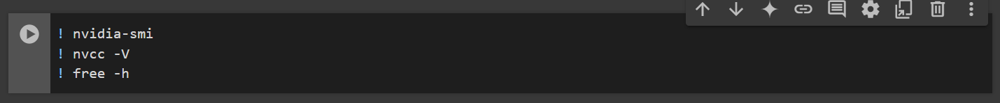
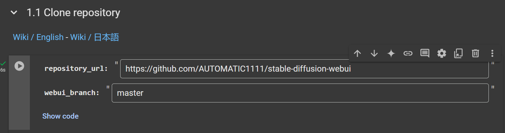
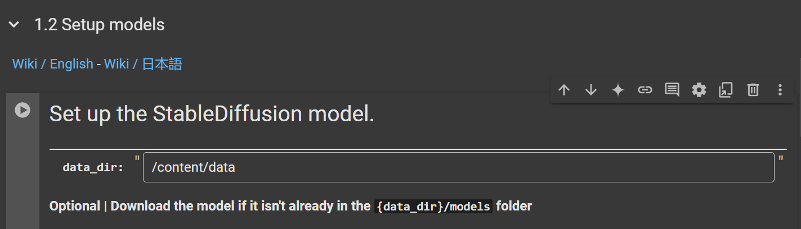

# Run Automatic1111 with Google Colab

## run [pouya_Customize_automatic1111](./pouya_Customize_automatic1111.ipynb) in the following order : 👇


## you can get help with wiki link in code
---

# Run in Googl Colab : 💥


- ### run this block 👇 
   
  - ### to connect the GPU then you see system information like this :
   ```bash
    
    +---------------------------------------------------------------------------------------+
    | NVIDIA-SMI 535.104.05             Driver Version: 535.104.05   CUDA Version: 12.2     |
    |-----------------------------------------+----------------------+----------------------+
    | GPU  Name                 Persistence-M | Bus-Id        Disp.A | Volatile Uncorr. ECC |
    | Fan  Temp   Perf          Pwr:Usage/Cap |         Memory-Usage | GPU-Util  Compute M. |
    |                                         |                      |               MIG M. |
    |=========================================+======================+======================|
    |   0  Tesla T4                       Off | 00000000:00:04.0 Off |                    0 |
    | N/A   38C    P8               9W /  70W |      0MiB / 15360MiB |      0%      Default |
    |                                         |                      |                  N/A |
    +-----------------------------------------+----------------------+----------------------+
                                                                                            
    +---------------------------------------------------------------------------------------+
    | Processes:                                                                            |
    |  GPU   GI   CI        PID   Type   Process name                            GPU Memory |
    |        ID   ID                                                             Usage      |
    |=======================================================================================|
    |  No running processes found                                                           |
    +---------------------------------------------------------------------------------------+
    nvcc: NVIDIA (R) Cuda compiler driver
    Copyright (c) 2005-2023 NVIDIA Corporation
    Built on Tue_Aug_15_22:02:13_PDT_2023
    Cuda compilation tools, release 12.2, V12.2.140
    Build cuda_12.2.r12.2/compiler.33191640_0
                total        used        free      shared  buff/cache   available
    Mem:            12Gi       664Mi       9.2Gi       1.0Mi       2.8Gi        11Gi

    ```
- ### run 1-1 block to clone autumatic1111 repo 👇
   


- ### run 1-2 block to setup autumatic1111 models  👇
    
    - ### put in the text boxes this inputs :
      - ### data_dir : /content/data
      - ### auth_token: signup to huggingface and get [token](https://huggingface.co/settings/tokens) then put it here
      - ### download_if_missing: ✅
      - ### model_url: , vae_url: ---> recommend download models and vaes whith [pouya_download_in_drive](../../download_in_gdrive/pouya_download_in_drive.ipynb) you can read document tn [README](../../download_in_gdrive/README.md)
      - ### use_vae: ✅
      - ### mount_google_drive: ✅
      - ### data_dir_gdrive: paste path of Automatic111 Defult is ```/content/drive/MyDrive/AI/automatic1111```
      - ### force_model_download_locally: ❌
      - ### force_remount: ❌