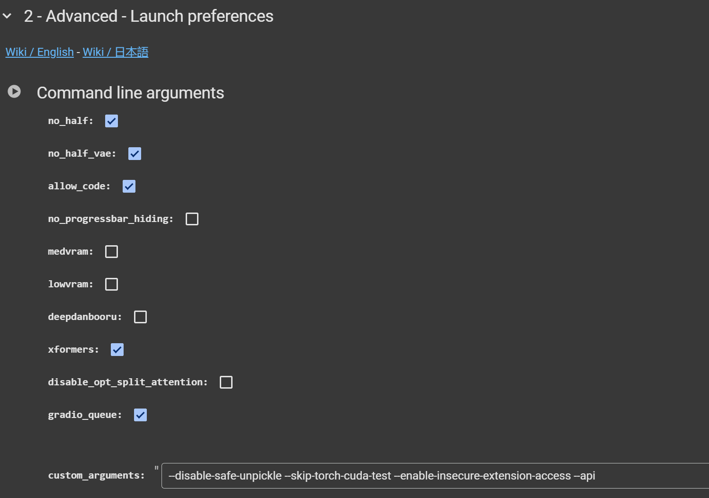
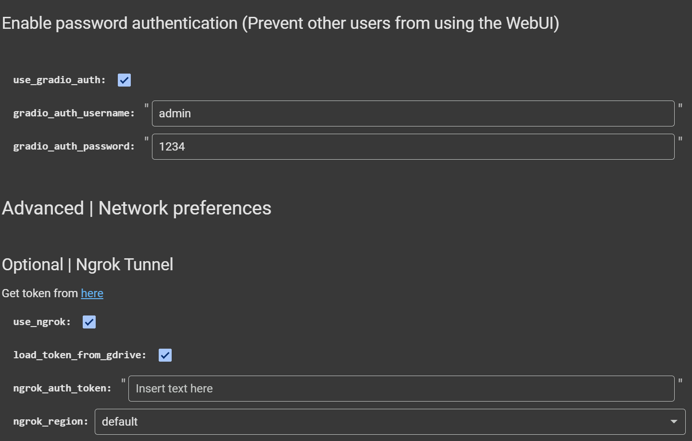
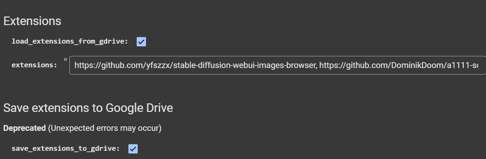
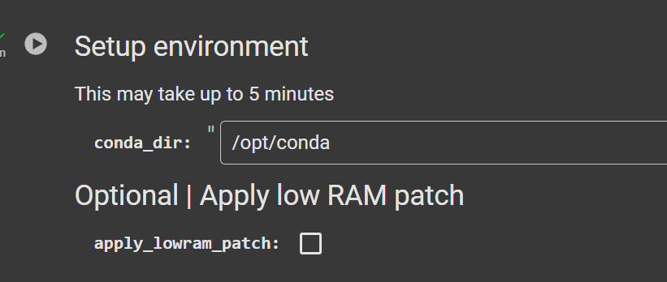

# Run Automatic1111 with Google Colab

## run [pouya_Customize_automatic1111](./pouya_Customize_automatic1111.ipynb) in the following order : 👇


## you can get help with wiki link in code
---

# Run in Googl Colab : 💥


- ## run fairst block 👇 
   
  - ### to connect the GPU then you see system information like this :
   ```bash
    
    +---------------------------------------------------------------------------------------+
    | NVIDIA-SMI 535.104.05             Driver Version: 535.104.05   CUDA Version: 12.2     |
    |-----------------------------------------+----------------------+----------------------+
    | GPU  Name                 Persistence-M | Bus-Id        Disp.A | Volatile Uncorr. ECC |
    | Fan  Temp   Perf          Pwr:Usage/Cap |         Memory-Usage | GPU-Util  Compute M. |
    |                                         |                      |               MIG M. |
    |=========================================+======================+======================|
    |   0  Tesla T4                       Off | 00000000:00:04.0 Off |                    0 |
    | N/A   38C    P8               9W /  70W |      0MiB / 15360MiB |      0%      Default |
    |                                         |                      |                  N/A |
    +-----------------------------------------+----------------------+----------------------+
                                                                                            
    +---------------------------------------------------------------------------------------+
    | Processes:                                                                            |
    |  GPU   GI   CI        PID   Type   Process name                            GPU Memory |
    |        ID   ID                                                             Usage      |
    |=======================================================================================|
    |  No running processes found                                                           |
    +---------------------------------------------------------------------------------------+
    nvcc: NVIDIA (R) Cuda compiler driver
    Copyright (c) 2005-2023 NVIDIA Corporation
    Built on Tue_Aug_15_22:02:13_PDT_2023
    Cuda compilation tools, release 12.2, V12.2.140
    Build cuda_12.2.r12.2/compiler.33191640_0
                total        used        free      shared  buff/cache   available
    Mem:            12Gi       664Mi       9.2Gi       1.0Mi       2.8Gi        11Gi

    ```
- ### run 1-1 block to clone autumatic1111 repo 👇
   


- ### run 1-2 block to setup autumatic1111 models  👇
    
    - ### put in the text boxes this inputs :
      - ### data_dir : /content/data
      - ### auth_token: signup to huggingface and get [token](https://huggingface.co/settings/tokens) then put it here
      - ### download_if_missing: ✅
      - ### model_url: , vae_url: ---> recommend download models and vaes whith [pouya_download_in_drive](../../download_in_gdrive/pouya_download_in_drive.ipynb) you can read document tn [README](../../download_in_gdrive/README.md)
      - ### use_vae: ✅
      - ### mount_google_drive: ✅
      - ### data_dir_gdrive: paste path of Automatic111 Defult is ```/content/drive/MyDrive/AI/automatic1111```
      - ### force_model_download_locally: ❌
      - ### force_remount: ❌
    - ### output: 
       ```bash
        /content
        Mounted at /content/drive
        ```


- ## run block 2 with these options 👇
   
   - ### no_half: ✅
   - ### no_half_vae: ✅
   - ### allow_code: ✅
   - ### no_progressbar_hiding: ❌
   - ### medvram: ❌
   - ### lowvram: ❌
   - ### deepdanbooru: ❌
   - ### xformers: ✅
   - ### disable_opt_split_attention: ❌
   - ### gradio_queue: ✅

   - ### custom_arguments: --disable-safe-unpickle --skip-torch-cuda-test --enable-insecure-extension-access --api --precision full --autolaunch --update-check --disable-nan-check
   - ```'--api   --precision full'``` are Optional
 - ## next authentication:
   
   - ### if you want to use login page 👇
   - ### use_gradio_auth: ✅
   - ### gradio_auth_username: select username
   - ### gradio_auth_password: select password
 - ## next ngrok
   - ### if you want to use ngrok (Recommended use for stable usage) 👇
   - ### use_ngrok: ✅
   - ### load_token_from_gdrive: ✅
   - ### ngrok_auth_token: enter ngrok token -> [get ngrok token](https://dashboard.ngrok.com/get-started/your-authtoken)
   - ### ngrok_region: default or select region
 - ## next save / load extentions 👇
     
     - ### load_extensions_from_gdrive:✅
    - ### extensions: extentions link -> ```https://github.com/yfszzx/stable-diffusion-webui-images-browser, https://github.com/DominikDoom/a1111-sd-webui-tagcomplete```
    - ### Save extensions to Google Drive 👇
    - ### (Unexpected errors may occur)
    - ### save_extensions_to_gdrive: ✅


- ## run block 3 with these options 👇
    
    - ### conda_dir: ```/opt/conda```
    - ### apply_lowram_patch: ❌


- ## RUN
    
    - ### if you use ngrok see link like this : ```ngrok connected to localhost:7860! URL: https://9391-64-155-187-147.ngrok-free.app```

