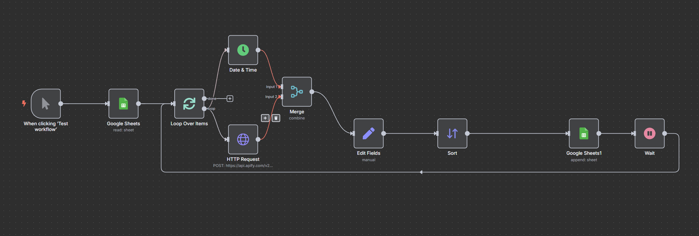

# طراحی و پیاده‌سازی سیستم هوشمند استخراج و تحلیل محتوای Instagram Reels با استفاده از پلتفرم اتوماسیون N8N 

### 1. بررسی اجمالی پروژه

این پروژه یک WorkFlow در n8n را توصیف می‌کند که برای استخراج اطلاعات Reels از پروفایل‌های مشخص اینستاگرام طراحی شده است. داده‌های استخراج‌شده سپس در یک Google Sheet برای تحلیل بیشتر ذخیره می‌شوند. این گردش کار به صورت دستی آغاز می‌شود و برای هر پروفایل مشخص‌شده در یک Google Sheet ورودی، اطلاعات Reels را جمع‌آوری می‌کند.

همچنین میتوان تنظیم کرد که برای مثال هر هفته این سیستم داده ها را جمع آوری و در گوگل شیت ذخیره کند

---

### 2. اهداف

- اتوماسیون فرآیند جمع‌آوری داده‌های Reels اینستاگرام از لیست مشخصی از تولیدکنندگان محتوا (creators).
- استخراج معیارهای کلیدی مانند تعداد بازدید، لایک، کامنت و سایر متادیتاهای هر Reel.
- ذخیره داده‌های ساختاریافته در Google Sheet برای دسترسی و تحلیل آسان.

---

### 3. پیش‌نیازها

- یک نمونه (instance) فعال از n8n  
- دسترسی به حساب Apify با API Token معتبر  
- یک حساب Google با دسترسی به Google Sheets API 
- یک Google Sheets با دو شیت:  
    - شیت ورودی (creators): حاوی ستون `instagram username`
    - شیت خروجی (videos): برای ذخیره اطلاعات استخراج‌شده

---

### 4. شرح گردش کار (Workflow)

1. **Trigger Manual:** آغاز دستی (میتوان با تایم برای اجرای زمان دار مثلا هر هفته جابجا کرد)
2. **Google Sheets (CREATOR NAME):** خواندن نام‌های کاربری
3. **Loop Over Items (SplitInBatches):** پردازش کاربران به صورت تکی
4. **Request HTTP:** ارسال درخواست به Apify
5. **Time & Date:** دریافت تاریخ و زمان لحظه‌ای (منطقه زمانی Tehran/Asia)
6. **Merge:** ادغام داده‌های دریافتی با تاریخ
7. **Set (Fields Edit):** انتخاب و قالب‌بندی داده‌ها
8. **Sort:** مرتب‌سازی بر اساس videoPlayCount
9. **Google Sheets (VIDEOS):** ذخیره در Google Sheet
10. **Wait:** تأخیر ۱۵ ثانیه‌ای بین هر تکرار

---

### 5. پیکربندی گره‌ها 

- با import کردن فایل [instaScraper.json](.\instaScraper.json) درون همین ریپازیتوری تنظیمات گره ها اعمال میشوند

### 6. ساختار داده‌ها

نمونه فیلدهای خروجی:
- `id`
- `type`
- `caption`
- `hashtags`
- `mentions`
- `url`
- `commentsCount`
- `likesCount`
- `videoPlayCount`
- `timestamp`
- `displayUrl`
- `videoUrl`
- `ownerUsername`
- `videoDuration`
- `currentDate`

---

### 7. ملاحظات

- رعایت محدودیت‌های API  
- بررسی شرایط سرویس‌های Apify و Instagram

# تصویر workFlow

